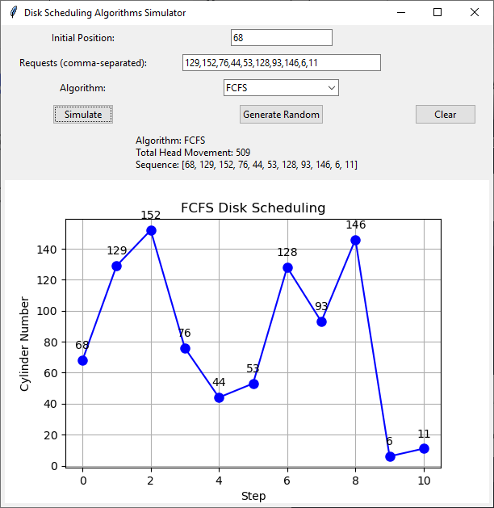
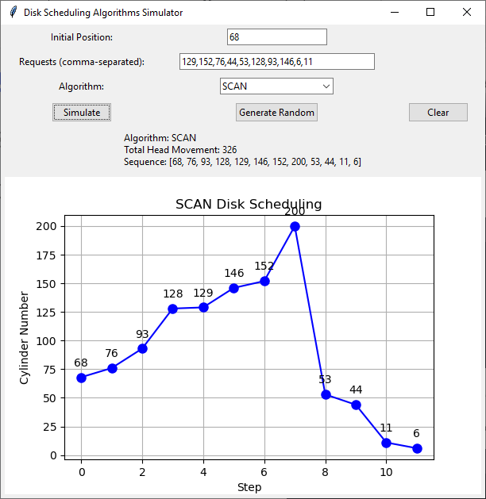

# Disk Scheduling Algorithms Simulator
This application simulates various disk scheduling algorithms with visualizations. Key implementation details:



**Core Features:**
- Implements 6 disk scheduling algorithms:
  - FCFS (First-Come, First-Served)
  - SSTF (Shortest Seek Time First)
  - SCAN (Elevator Algorithm)
  - C-SCAN (Circular SCAN)
  - LOOK 
  - C-LOOK
- Default disk size set to 200 cylinders (configurable in code)
- Visualizes head movement sequence using matplotlib
- Calculates total head movement for performance comparison

**Technical Implementation:**
- GUI built with Tkinter for accessibility
- Matplotlib integration for dynamic plotting
- Modular architecture separating:
  - GUI components (`DiskSchedulingApp` class)
  - Algorithm logic (separate methods for each algorithm)
  - Visualization routines
- Error handling for invalid inputs
- Random request generation capability

**Design Choices:**
- Used SCAN/C-SCAN with directional bias (right-first movement)
- Implemented LOOK as modified SCAN without disk boundaries
- Default disk size 200 to match traditional HDD specifications
- Color-coded visualization for better readability

## How to Use

### Installation
1. Clone the repository:
```bash
git clone https://github.com/yourusername/disk-scheduling-simulator.git
```
2. Install dependencies:
```bash
pip install -r requirements.txt
```
## Running the Application
```bash
python main.py
```
### Interface Guide
1. **Input Fields:**
   - Initial Position: Starting head position (0-200)
   - Requests: Comma-separated list of cylinder requests
   
2. **Controls:**
   - Algorithm Selection: Choose from 6 scheduling algorithms
   - Generate Random: Auto-fill with random values
   - Clear: Reset all fields
   - Simulate: Run selected algorithm

3. **Interpreting Results:**
- Head movement sequence shown in plot
- Total movement displayed below controls
- Hover over plot points to see cylinder numbers

### Example Test Case
**Input:**
- Initial Position: 95
- Requests: 50, 120, 30, 180
- Algorithm: LOOK

**Expected Output:**
- Total Movement: 235
- Sequence: [95 → 120 → 180 → 50 → 30]


### Testing Different Algorithms
Use these sample inputs to verify implementations:

| Algorithm | Initial | Requests        | Expected Total Movement |
|-----------|---------|-----------------|-------------------------|
| FCFS      | 50      | 55,91,27,85     | 163                     |
| C-SCAN    | 95      | 50,120,30,180   | 355                     |
| SSTF      | 50      | 55,91,27,85     | 105                     |

## Configuration
To modify default settings:
- Change disk size: Edit `disk_size` parameter in SCAN/C-SCAN methods
- Adjust visualization: Modify `figsize` in `self.figure = plt.figure(figsize=(6, 4))`


## Contributing
Pull requests welcome! For major changes, please open an issue first.

## License
```text
MIT License
Copyright (c) [2024] [Attila Asghari]
```